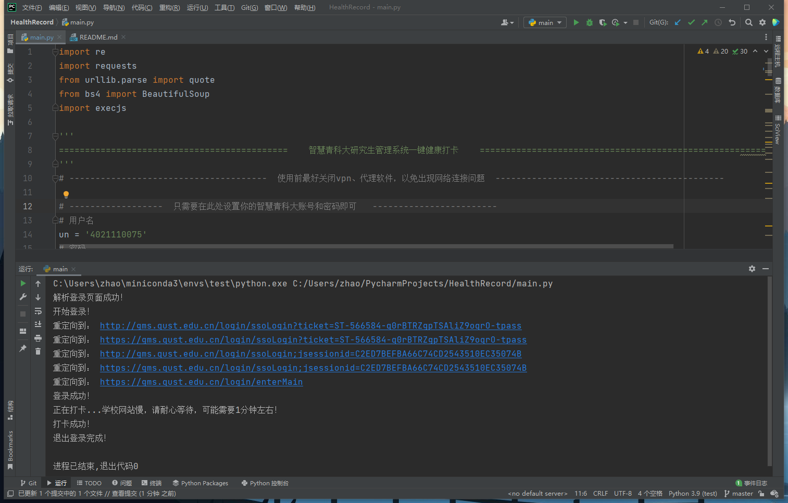
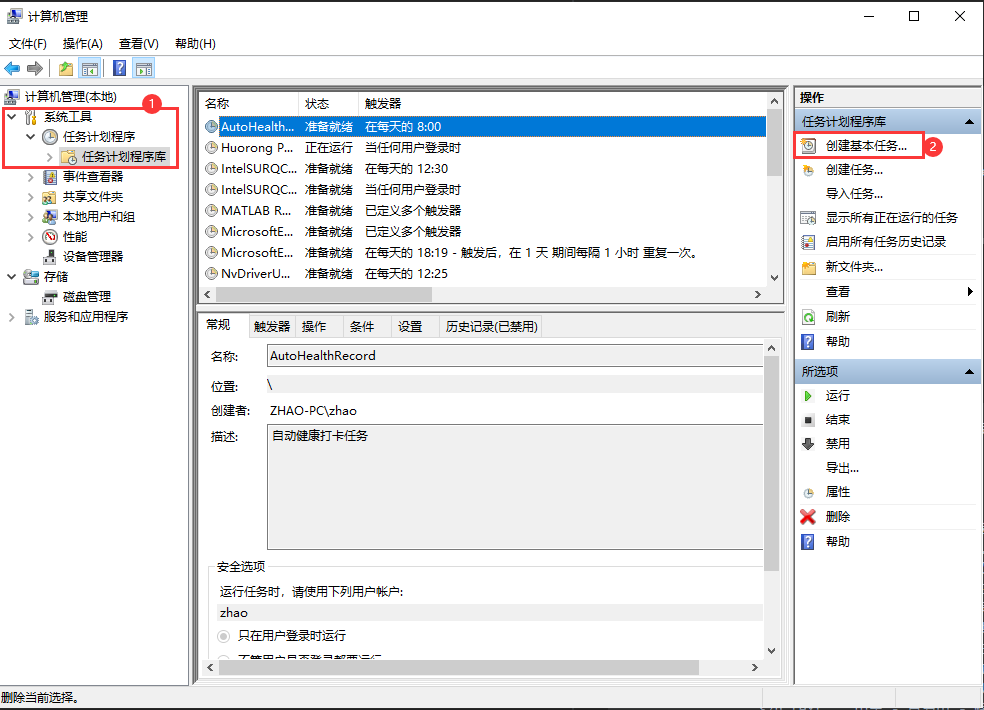
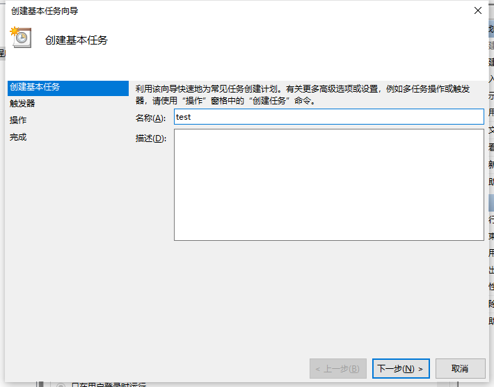
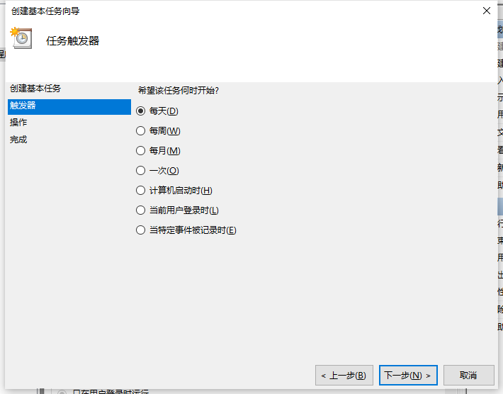
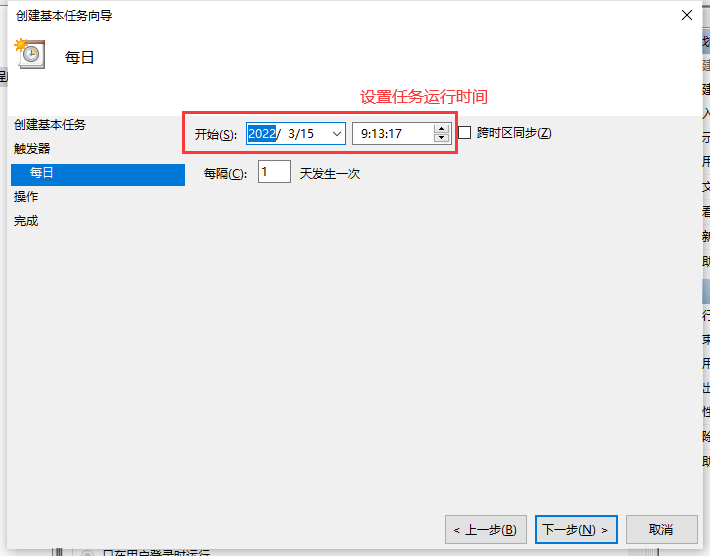
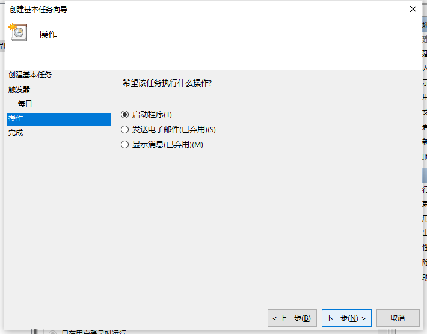
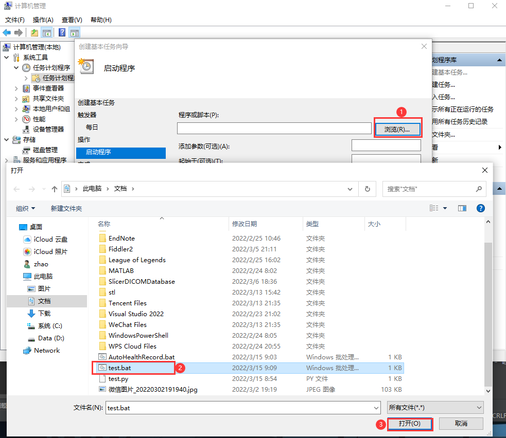
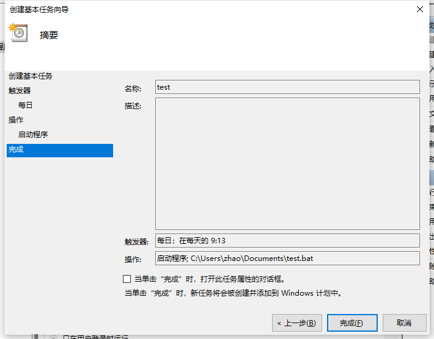

# 智慧青科大一键健康打卡

### 下载
```
git clone https://github.com/crazy-zxx/HealthRecord.git
```
或者直接 code --> Download Zip ，然后解压

### 使用

#### 环境搭建

```
# 创建虚拟环境
conda create --name healthRecord
# 激活虚拟环境
conda activate healthRecord
# 安装依赖包：
pip install -r requirements.txt
```

#### 配置

```
# 进入目录，直接下载的解压后文件夹名字可能是HealthRecord-master
cd HealthRecord
```
修改main.py中的用户名密码
```
# ------------------  只需要在此处设置你的智慧青科大账号和密码即可   ------------------------
# 用户名
un = '4021110075'
# 密码
pd = '12345678'
```

#### 运行

然后运行该脚本即可
```
python main.py
```

#### 打卡成功




### 打卡自动化

#### Windows本机通过计划任务实现

1.新建一个bat脚本，用于执行python脚本
```
%切换到代码所在目录%
cd C:\Users\zhao\PycharmProjects\HealthRecord
%切换到conda的虚拟环境，文件位置自己按需修改%
call C:\Users\zhao\miniconda3\Scripts\activate.bat C:\Users\zhao\miniconda3\envs\healthRecord
%执行脚本%
python main.py
%在执行完py后显示结果的命令行界面暂停，便于查看结果%
pause
```
2.添加任务（此电脑右键管理）









<br>

#### 腾讯云服务器版（有邮箱通知）
[智慧青科大健康打卡腾讯云版](https://github.com/crazy-zxx/HealthRecordCloud)

<br>

### 注意

由于各种不可抗拒力，自动化打卡不保证一定成功，请勿过度依赖！！！

默认打卡地点为崂山区，以后会更新其他地区
```
# ---------------------  提交数据，固定格式请勿乱动！！！ ---------------------
data = {
        "id": None,
        "collectId": parent_data_id,
        "data": {
                "szd": "370212", # 所在地。。崂山区370212，至于其他城市有时间再添加 
                "tw": "37.2℃及以下", # 体温。。仅可自行修改为：37.2℃及以下、37.3℃-37.9℃、38℃及以上
                "stzk": "健康", # 身体状况。。仅可自行修改为：健康、发烧、干咳、乏力、其他
                "zgfxq": "否", # 近14天你或你的共同居住人是否有疫情中、高风险区域人员接触史。。仅可自行修改为：是、否
                "mj": "否", # 近14天你或你的共同居住人是否和确诊、疑似病人接触过。。仅可自行修改为：是、否
                "ysbl": "否", # 近14天你或你的共同居住人是否是确诊、疑似病例。。仅可自行修改为：是、否
                "yxgl": "否", # 你和你的共同居住人目前是否被医学隔离。。仅可自行修改为：是、否
                "jkmys": "绿色", # 今天你当地的健康码颜色是。。仅可自行修改为：绿色、黄色、红色
                "cn": "是", # 本人是否承诺以上所填报内容属实、准确，不存在任何隐瞒与不实情况，更无遗漏之处。。仅可自行修改为：是、否
                "szd_text": "山东 - 青岛市 - 崂山区", # 所在地全称：山东 - 青岛市 - 崂山区，以下数据信息同上
                "tw_text": "37.2℃及以下",
                "stzk_text": "健康",
                "zgfxq_text": "否",
                "mj_text": "否",
                "ysbl_text": "否",
                "yxgl_text": "否",
                "jkmys_text": "绿色",
                "cn_text": "是"
                },
        "collectChildId": child_data_id
}
```

打卡失败原因
```
1. 账号或密码错误
2. 请关闭vpn或网络代理软件
3. 我也不知道了
```

### 声明
对于用户使用该项目可能造成的不良后果，本人概不负责！！！